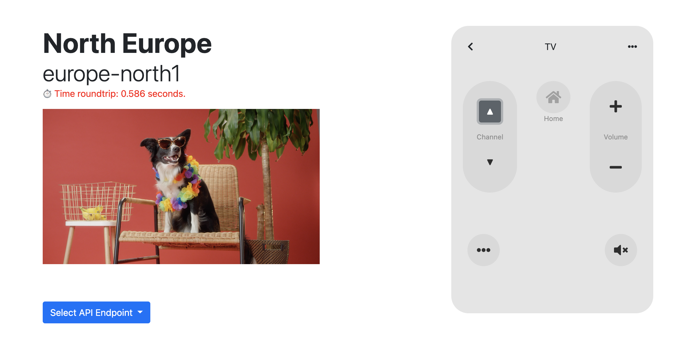

# When latency matters!



## Steps to deploy
1. Deploy backends into CloudRun
    - ```cd src/backends/auth & gcloud run deploy```
    - ```cd ../content-backend & gcloud run deploy```
2. Upload proxies to Apigee X.
    - Locate proxies under the folder ```src/proxies``` 
    - Follow this link for instructions: https://cloud.google.com/apigee/docs/api-platform/fundamentals/download-api-proxies#ui 
    - Replace the Target Endpoints with the ones created by Cloud Run.
3. Create an *API Product* with both **oauth** and **channels** proxies. 
    - Follow this link for instructions: https://cloud.google.com/apigee/docs/api-platform/publish/create-api-products
4. Create a *Developer* and an *App* based on that *API Product*
    - Follow this link for instructions to create a developer: https://cloud.google.com/apigee/docs/api-platform/publish/adding-developers-your-api-product
    - Follow this link for instrunctions to create an App: https://cloud.google.com/apigee/docs/api-platform/publish/creating-apps-surface-your-api
5. Repeat steps 2, 3 and 4 for every region.
5. Fill out the file ```variables.js.copy```
    ```
    var defaultIp = ""; //Default IP is the IP of the Load Balancer of Apigee
    var apisecret= ""; //API Secret from the generated App.
    var apikey= ""; //API Key from the generated App.
    var original_url = ""; //First API Endpoint to use including API Key. "https://endpoint/v1/channel?apikey="+apikey;
    var region_north = ""; //Enpoint for north region Apigee
    var region_south = ""; //Enpoint for sourh region Apigee
    var region_us = ""; //Enpoint for US region Apigee
    var url_oauth = ""; //oauth Endpoint "https://endpoint/v1/oauth/accesstoken?grant_type=client_credentials";
    ```
6. Open index.html and start playing!